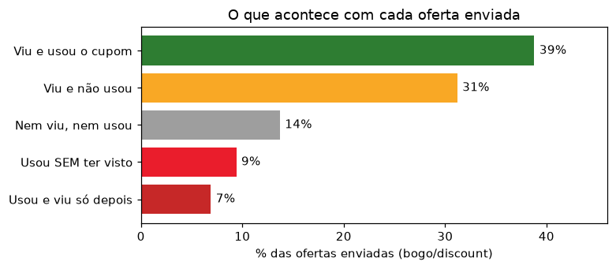
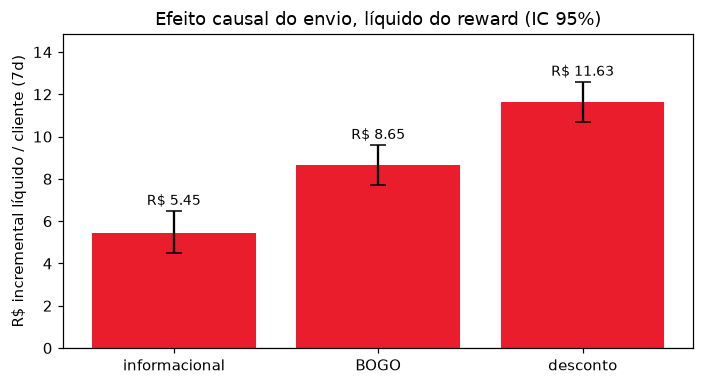
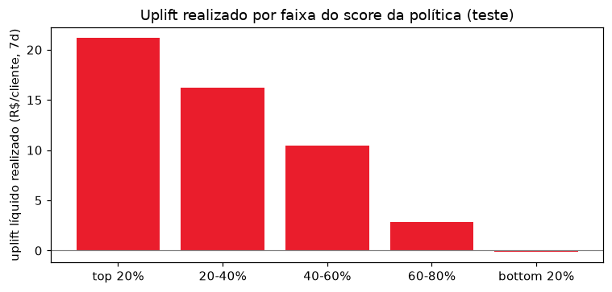
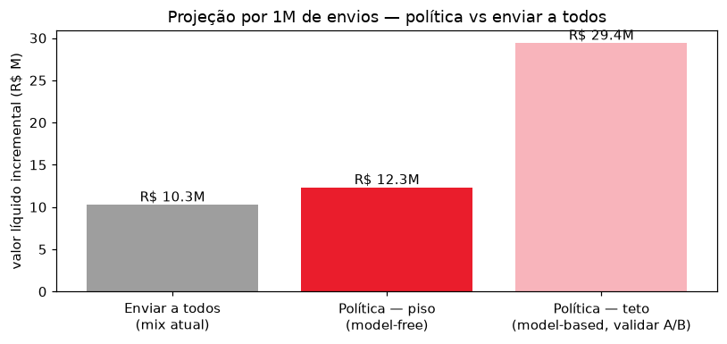

# Case iFood — Apresentação (5 slides)

> Versão em markdown do deck (`ifood_case.pptx`). Público: lideranças de negócio.

---

## Slide 1 — O problema não é quanto se gasta em cupom. É para quem se manda.

Medimos o quanto cada envio realmente gera de venda nova — e descobrimos que
**9 em cada 10 clientes recebem a oferta errada**.

*17 mil clientes · 306 mil eventos · 76 mil envios em 6 campanhas · 30 dias.*

---

## Slide 2 — O problema: quase um terço do desconto sai do caixa sem gerar nada

> **30% dos cupons são usados sem o cliente ter visto a oferta antes.**

O cliente faz uma compra normal, atinge o valor mínimo sem saber que havia uma
oferta — e o sistema desconta automaticamente. É uma venda que aconteceria de
qualquer forma, só que mais barata para o cliente e mais cara para a empresa.

---

## Slide 3 — Enviar compensa, mas o efeito depende muito da oferta

**Como medimos:** em cada campanha, 25% dos clientes não receberam nada. Esse grupo
mostra o que teria acontecido sem o envio; a diferença entre os dois grupos é a
venda que o envio causou.

> **R$ 9,21 de venda nova por cliente, em 7 dias** — já descontado o custo do cupom.
> Desconto rende 34% mais que BOGO.

---

## Slide 4 — Dá para saber, antes de enviar, em quem a oferta faz diferença

Testado em campanhas **futuras**: o modelo ordena os clientes por quanto a oferta
deve render em cada um. No grupo apontado como prioridade, o envio gerou **R$ 21**
por cliente. No último grupo, **zero**.

> **Hoje, só 10% recebem a oferta certa para eles.**
> O maior ganho não é enviar menos — é enviar melhor.

---

## Slide 5 — A conclusão: com o mesmo orçamento, 20% mais resultado

### O que aprendemos

**1. Cupom funciona — mas não para todos.**
O efeito médio é positivo, porém vai de R$ 21 a zero dependendo da pessoa.

**2. Medir "quem usou o cupom" engana.**
Quem gasta muito usa cupom de qualquer jeito. Só comparando com quem não recebeu
dá para saber o que a oferta realmente causou.

**3. O dinheiro está em acertar o alvo.**
Não em cortar envios: 90% recebem a oferta errada, e corrigir isso rende +20%.

*Por 1 milhão de envios: de R$ 10,3M para R$ 12,3M. Há potencial maior com
personalização total — número de modelo, a confirmar em teste A/B.*

**Próximo passo:** teste A/B com grupo de controle.
