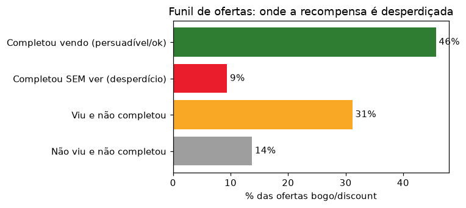
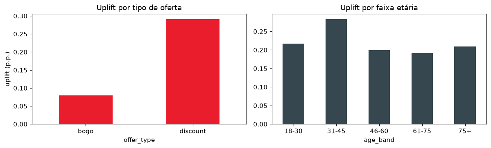
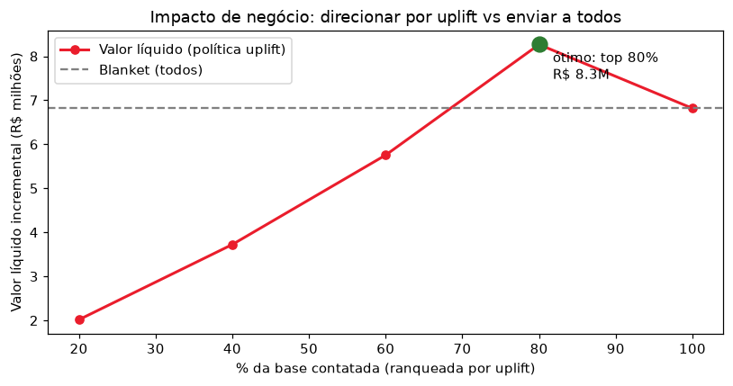

# iFood · Otimização de Cupons — Apresentação (5 slides)

> Versão em markdown do deck. O arquivo editável está em `ifood_case.pptx`.
> Público: líderes de negócio (não técnicos).

---

## Slide 1 — Enviar a oferta certa, para o cliente certo

**Uplift modeling** para maximizar o retorno *incremental* dos cupons — parando de
gastar recompensa com quem já compraria.

*Base: ~306 mil eventos, 17 mil clientes, 10 tipos de oferta.*

---

## Slide 2 — O problema: parte do orçamento de cupons é desperdiçada

- **1 em cada 10 cupons é completado SEM ser visto** → o cliente compraria de
  qualquer forma; a recompensa é dinheiro jogado fora.
- **31%** veem o cupom e não usam → mídia sem retorno.
- **Enviar para todos não é a estratégia mais rentável.**

---

## Slide 3 — A solução: prever o efeito INCREMENTAL (uplift)

Em vez de prever *quem completa*, prevemos *quanto a oferta muda o comportamento*.
Isso separa: **persuadíveis** (enviar), **já comprariam** (não enviar → economia) e
**não respondem** (não enviar).

> **Descoberta:** cupons de **desconto** têm uplift ~4x maior que **BOGO**
> (+29 vs +8 pontos percentuais).

---

## Slide 4 — O impacto: mais valor com menos envios

Projeção por **1 milhão de cupons**:

| Métrica | Ganho |
|---|---|
| Valor líquido incremental | **+R$ 1,45M (+21%)** vs enviar para todos |
| Cupons enviados | **−20%** (menos custo de mídia e recompensa) |
| Conclusões incrementais | **+13%** (ao cortar quem tem uplift negativo) |

*Ticket médio/conclusão R$ 52,60; recompensa média R$ 4,90.*

---

## Slide 5 — Como funciona e próximos passos

**Como funciona**
1. Modelo de uplift (T-learner/XGBoost) pontua cada cliente × oferta.
2. Recomenda a oferta de maior uplift — ou nenhuma.
3. Só envia a quem tem retorno incremental positivo (~10% da base não deve receber).

*Qualidade: ranqueia o uplift ~2x melhor que a abordagem padrão (Qini-AUC).*

**Próximos passos**
- A/B test com grupo de controle real (holdout sem oferta) para validar o uplift.
- Otimização de timing e canal do envio.
- Alocação sob orçamento (uplift por R$ investido).
- Colocar o score em produção no motor de campanhas de CRM.
